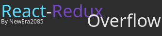
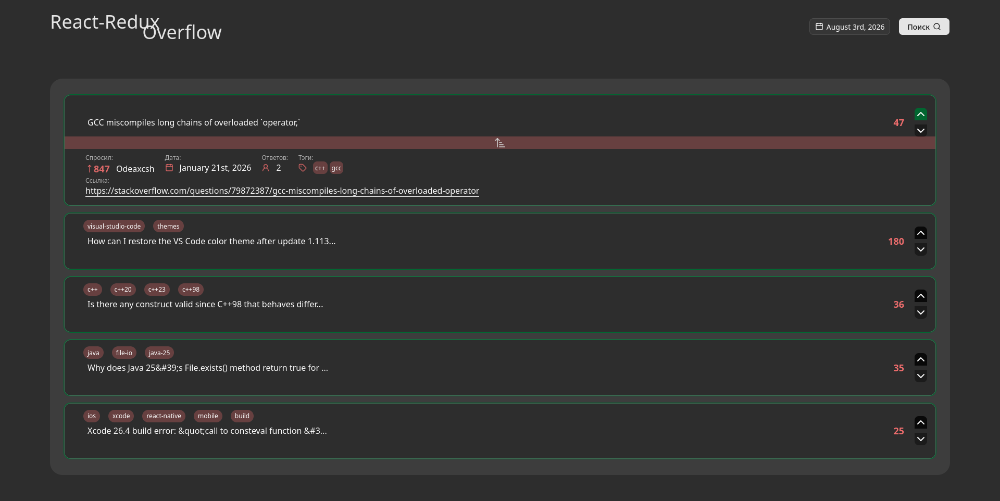
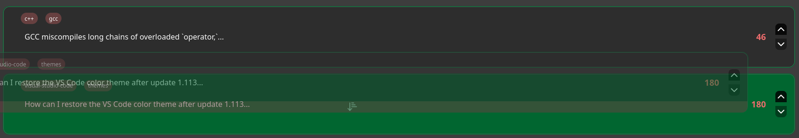
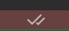
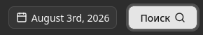
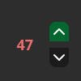

# React-Redux Overflow


---

## Краткий обзор

<div align="center">
  
</div>

Репозиторий создан в рамках тестового задания. Разработка заняла **четыре дня**.

**Основная задача:** отображение топ-5 вопросов с Stack Overflow, начиная с выбранной пользователем даты.

**Архитектура:** в качестве основы выбрана **модульная архитектура**, что обеспечивает гибкость и масштабируемость приложения.

---

## Использование

<div align="center">
  
</div>

### Взаимодействие с элементами списка

- **Одиночный клик** по элементу раскрывает его, показывая подробную информацию о вопросе: автор, дата создания, количество ответов и ссылка на оригинальный пост.
- **Двойной клик** выделяет элемент (под ним появляется галочка). При выборе второго элемента они меняются местами в списке.
- **Drag-and-Drop (DnD):** элемент можно перетащить, и при отпускании он меняется местами с элементом, над которым находится курсор.
- **Визуальная индикация:** вопросы, отмеченные как "получен ответ", выделяются зелёной рамкой.

### Управление датой и обновление списка

- При выборе даты, отличной от текущей, появляется кнопка **"Поиск"**. После её нажатия выполняется запрос к серверу, и список вопросов обновляется.

### Голосование (лайки/дизлайки)

- Лайки и дизлайки сохраняются до перезагрузки страницы. При смене даты голоса сохраняются.

### Переход по ссылке

- При клике на ссылку на пост открывается модальное окно с подтверждением перехода на внешний сайт.

---

## Фичи

<div align="">
  <figure>
     <br>
    <figcaption>Drag-and-Drop — перетаскивание элементов списка</figcaption>
  </figure>
</div>

<div align="">
  <figure>
     <br>
    <figcaption>Перестановка — двойной клик для обмена местами</figcaption>
  </figure>
</div>

<div align="">
  <figure>
     <br>
    <figcaption>Смена даты — обновление списка по выбранной дате</figcaption>
  </figure>
</div>

<div align="">
  <figure>
     <br>
    <figcaption>Лайки и дизлайки — кэшируются до перезагрузки страницы</figcaption>
  </figure>
</div>

---

## Стэк технологиций

| Категория                                        | Технологии                                                |
| ------------------------------------------------ | --------------------------------------------------------- |
| <span style="color:#61DAFB;">**Frontend**</span> | React, TypeScript, Tailwind CSS, Redux, shadcn/ui, Vitest |
| <span style="color:#f89820;">**Backend** </span> | StackOverflow API                                         |

---

## Установка и запуск

**ПРОДУКТ (варианты)**

1. Перейти по ссылке: https://scrumify.ru
2. В разделе __"Релизы"__ перейти на последний релиз

**РАЗРАБОТКА**

1. **Клонирование репозитория**

   ```bash
   git clone https://github.com/NewEra2084/BFG.git
   ```

2. **Установка зависимостей**

   ```bash
   cd BFG
   npm install
   ```

3. **Запуск в режиме разработки**

   ```bash
   npm run dev
   ```

4. **Сборка для production**

   ```bash
   npm run build
   ```

---

## Структура проекта

```bash
@/ - src - корневая директория
├── /components     - общие переиспользуемые компоненты
├── /lib            - утилиты и вспомогательные функции
├── /modules        - модули для построения UI
├── /store          - управление состоянием (Redux)
└── /styles         - конфигурация Tailwind и нормализация стилей
```

---

## Тестирование

Для тестирования используется библиотека Vitest. Тесты пишутся для каждого модуля локально в его папке. Тесты для хранилища находятся по пути:

```bash
  @/store/__tests__
```

### Запуск тестов:

```bash
  npm run test
```
